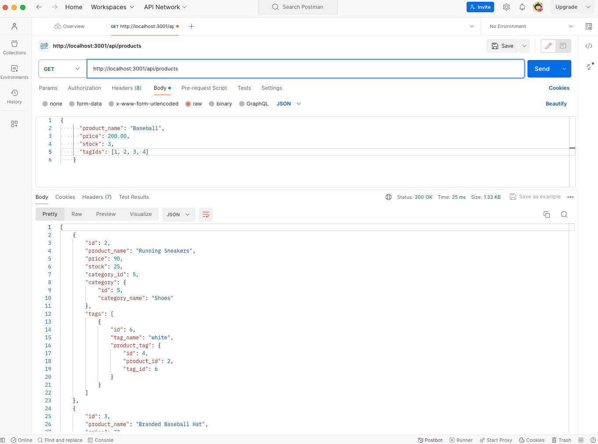
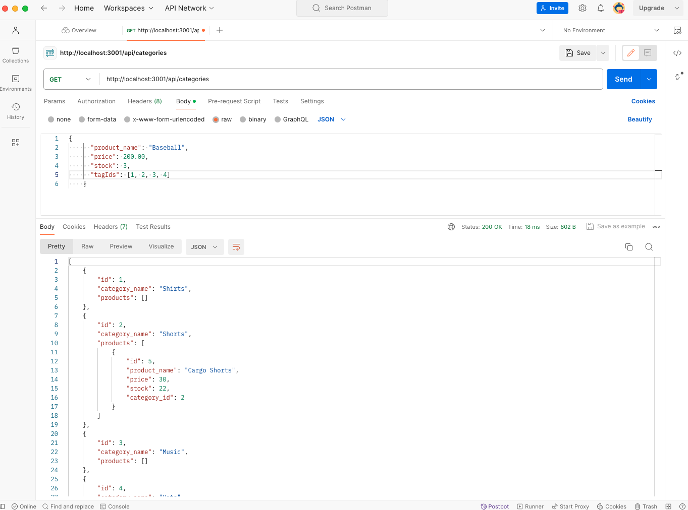
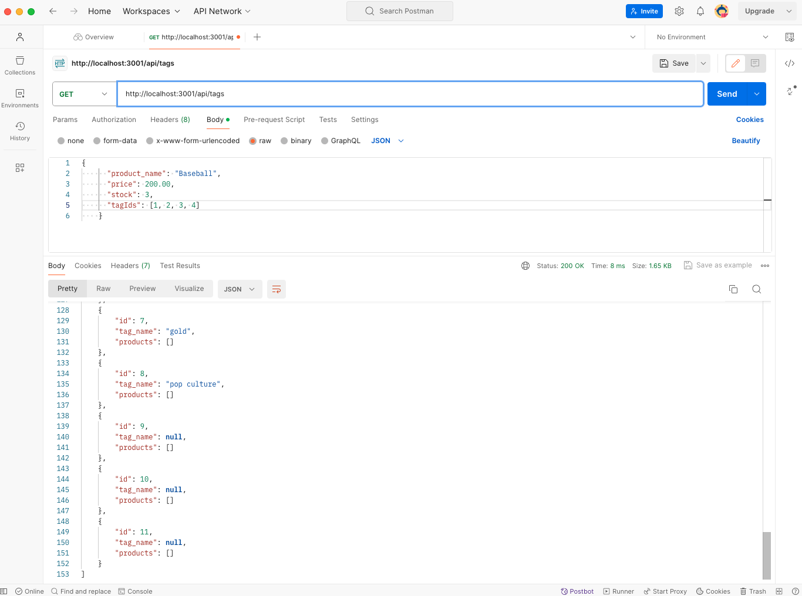
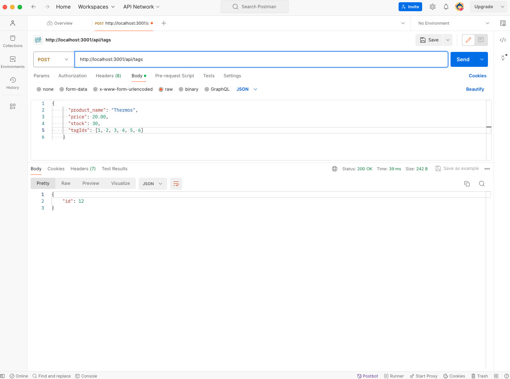
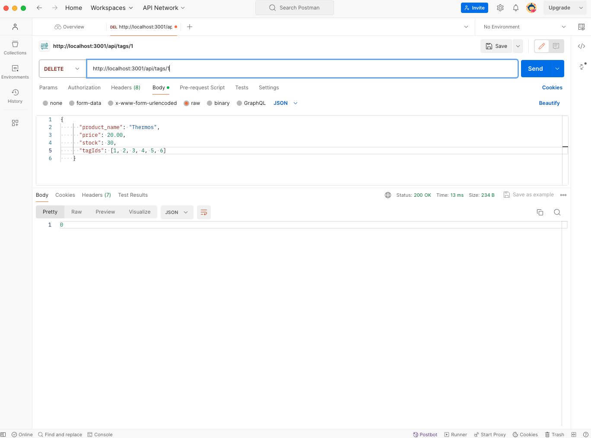
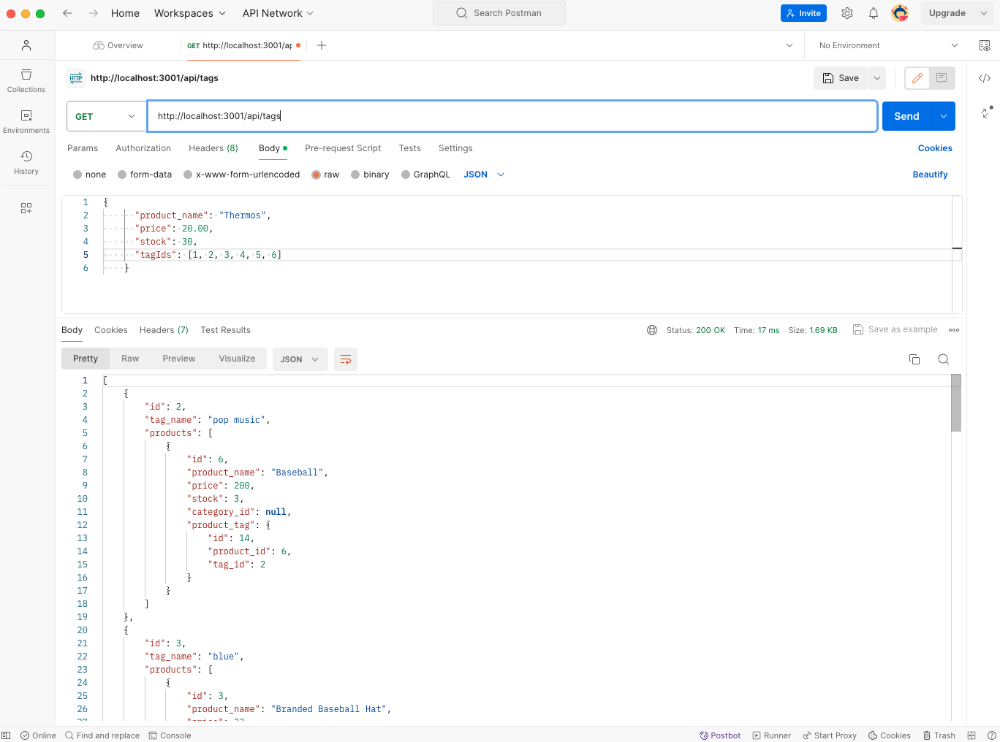
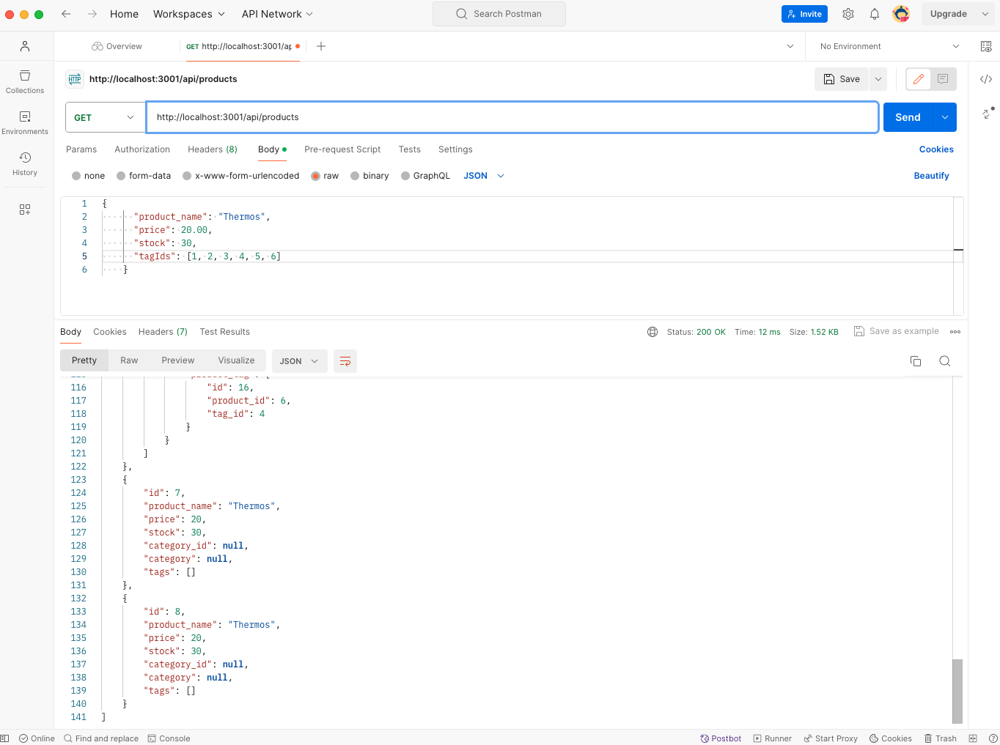
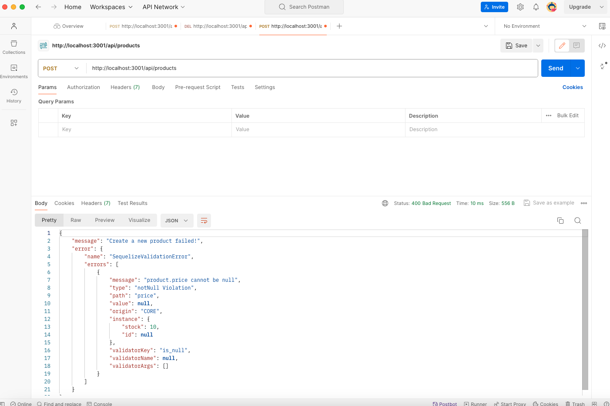

# my-e-commerce-store
- E-commerce store back end through the modification of starter-code

## Description
- The motivation for this project was to build the back-end for an e-commerce retail site through the configuration of a working Express.js API in order to use Sequelize to interact with a MySQl database. 
- This project was built to understand the fundamental architecture of e-commerce sites considering they are so prevalent. I could use this project to showcase my abilities to possible employers in the internet retail and/or to e-commerce platforms. Furthermore, I could utilize this application in the future to, coupled with all my coding skills after the completion of this course, create a platform for selling items myself. 
- This project was built using Express.js 4.17.1, Sequelize 5.21.7, MySQL2 2.1.0, Nodemon 2.3.3, Dotenv 8.2.0, Node.js, Postman and JavaScript.
- Challenges with this project arose mostly with the POST route in the product-routes.js file.
- There was also a syntax error in the Category.js file on line 11, which was causing erros in the terminal. Once this error was fixed, the terminal issues were resolved. 
- Another challenge, as with many assignments, is time as the syntax, and code in general, can be timely to write along with getting terminal errors resolved and the application running properly. 
- I learned how to implement CRUD operations to create, delete and update products on an e-commerce retail site. I also gained familarity with Postman. 
- Future devlopment for this project will be creating a front end for use in the browser.

## Installation
- Clone this repository to local environment
- Open repository in a source code editor (like Visual Studio Code)
- Set up npm package and install required dependencies with the following commands in the terminal:
    • npm i
    • npm nodemon
    • npm i express
    • npm i mysql2
    • npm i sequelize
    • npm i dotenv
- Add a .env file and update the password to reflect your my MySQL password
- Create your database with the following commands and/or instructions: 
    • mysql -u root -p 
    • Enter your MySQL password
    • source db/schema.sql 
- Run the application with the following commands in the terminal:
    • Run 'npm run seed' command in terminal 
    • Run 'npm start' command in the terminal  

## Usage
- Video showing usage of this project:

https://drive.google.com/file/d/1-zOw2PcWElPLSLjdyKT2k9Z9uHxsVa9D/view?usp=sharing

- Screenshots showing usage of this project.

## License 
- ISC

## Credits

Calle, T. (2023). Thomas Object Relational Mapping ORM E-commerce Back End SQL Employee Tracker. GitHub [Source Code]. https://github.com/ThomasCalle/Thomas-Object-Relational-Mapping-ORM-E-Commerce-Back-End.git

Calle, T. [THOSCALLE]. (2023, March 26). Thomas' Object-Relational Mapping (ORM): E-Commerce Back End | UofT Coding Bootcamp: Module 13 [Video]. YouTube. (https://www.youtube.com/watch?v=hGVJLTGqPgk)

Desmond, R., Larsen, J. (n.d.). POST Requests with Postman. Coding Nomads.  https://codingnomads.com/java-spring-postman-post-request

Hillary Nyakundi, H. (2021, December 08). How to Write a Good README File for Your GitHub Project. FreeCodeCamp. https://www.freecodecamp.org/news/how-to-write-a-good-readme-file/

Manandhar, G. (2023, July 27). Build a REST API with Node.js, Express, and MySQL. LogRocket. https://blog.logrocket.com/build-rest-api-node-express-mysql/

Tiglao, J. (2022). E-peddler. GitHub [Source Code]. https://github.com/jbtiglao/e-peddler.git

University of Toronto. (2023). Coding Boot Camp [Source Code].
